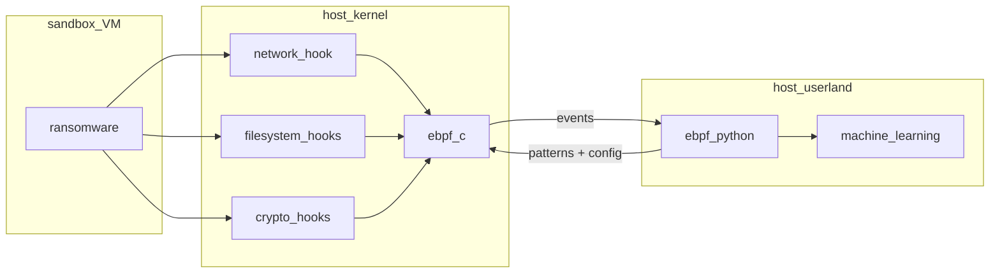

# EPITA-ebpf-detection - Ransomware Detection using Machine Learning with eBPF for Linux

Authors: Anthony Becuwe, Agustin Bouchon, Rémi Tang, Sabir Mohamed  
Supervisor : Nidà Meddouri

## Overview

This project is based on a paper written by 
Max Willers, Tomás Philippart which you can find [here](https://github.com/TomasPhilippart/ebpfangel/blob/main/docs/Ransomware_Detection_using_Machine_Learning_with_eBPF.pdf).  
The paper written by Max Willers and Tomás Philippart talks about the creation of a ransomeware detector using ebpf using machine learning. The paper on their realization highlighted a number of limitations, including **data imbalance**. Indeed, modeling data on ransomeware behavior can be tedious, given that you need to launch ransomeware in order to analyze its behavior.  
As part of our project, we decided to take up this challenge by following two distinct but overlapping paths.

- The first is to generate more ransomeware data by using many more ransomewares.
- The second is to use imbalanced data management methods.

### Data Generator

To generate the data, we use this architecture to run ransomware sample and generate data:



The actual implementation is designed to work in debian 11 with the 5.* kernel version. You will need to install some packages to run **ebpf** with **BCC**. Follow the install instruction in [detector/README.md](detector/README.md).  
  
To run the generator follow this steps :

```bash
make detector
```
You can now run your malware samples and the **detector** will keep all specifics data about ransomware behaviour.  

After that you will need to prepare the output data to machinelearning. 
So run :

```bash
make prep
```

You will get the generated data in [data](data) directory.  


https://github.com/icare-sh/EPITA-PFE-ebpfml/assets/99324716/c5f81ade-caca-4d71-b915-f105574289a6


### Handle imbalanced Data

In this section, we employ various techniques and methods to address imbalanced data. More information can be found in the [manage imbalanced data](manage_imbalanced_data) directory.  
  
Inside this directory, you will find multiple log files along with a notebook file: [EBPF_ML.ipynb](manage_imbalanced_data/EBPF_ML.ipynb), which details the entire process, methods used, and interpretation of results obtained from these methods.

## Prerequisties to run the project

```bash
sudo
python3
make
bpfcc-tools
libbpfcc
libbpfcc-dev 
```

## Learning resources and references

1. https://github.com/TomasPhilippart/ebpfangel/blob/main/docs/Ransomware_Detection_using_Machine_Learning_with_eBPF.pdf
2. https://www.kdnuggets.com/2017/06/7-techniques-handle-imbalanced-data.html
